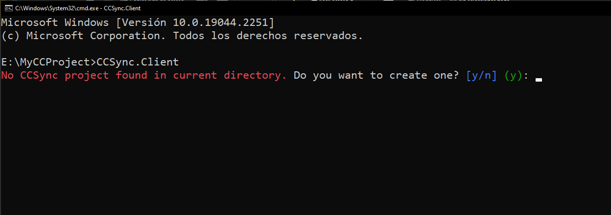
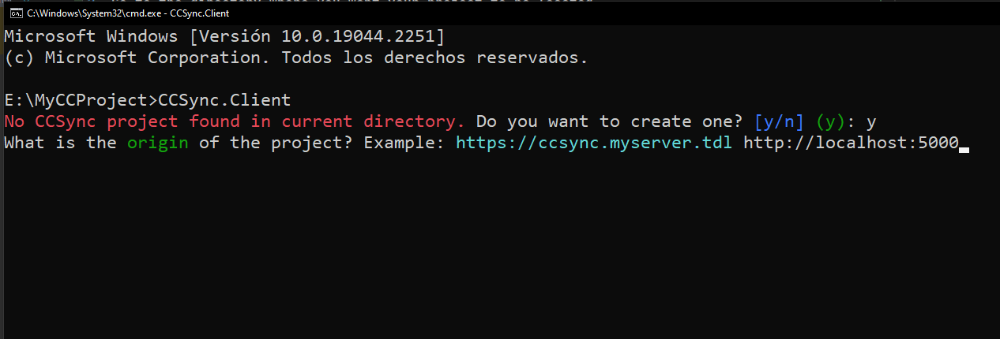
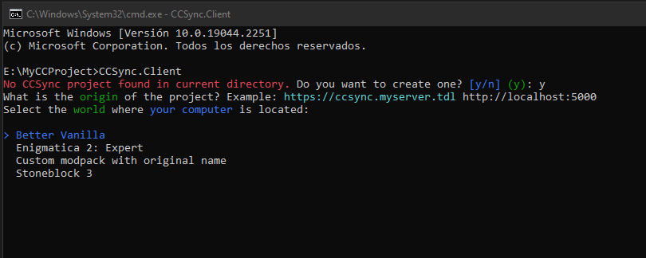
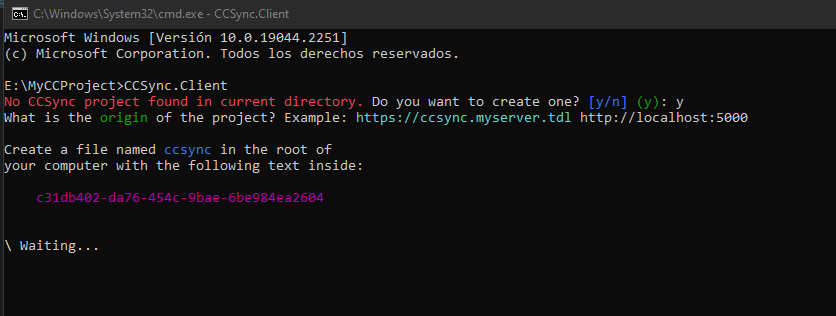
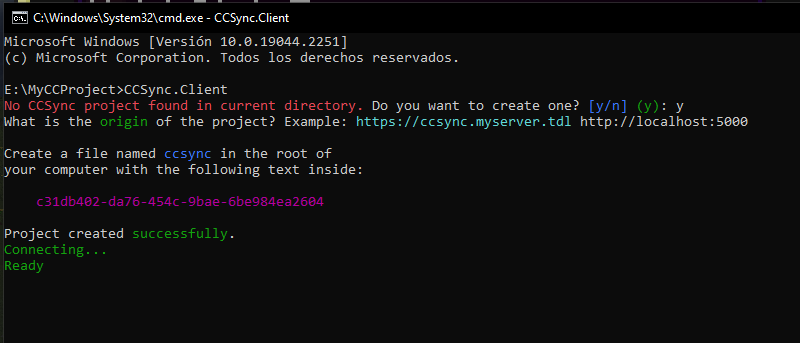

1. #### Download or compile the client
2. #### Go to the directory where you want your project to be located
3. #### Run `CCSync.Client` on that path

4. #### Enter the host of the CCSync server

5. #### Select the world were your computer is located

6. #### Authenticate your computer
    - Create a file named `ccsync` in the root of your computer
    - Paste the auto-generated key in the file
    - ⚠️The default edditor (`edit`) automatically adds the `.lua` extension when creating new files. You can change the file name using the move command like this: `mv ccsync.lua ccsync`
      
    - 
7. #### Have fun!
   Now that you have created and authenticated into your computer you can freely create, edit, modify, delete and whatever the files using any editor, they will be automatically synced both ways.
   